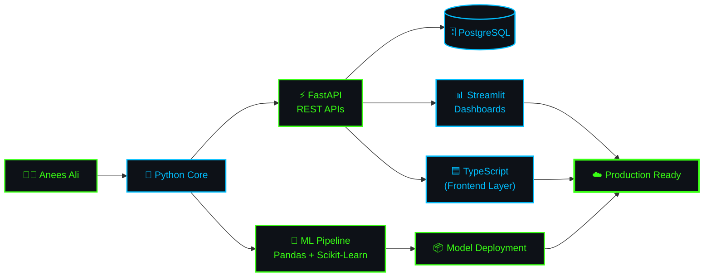
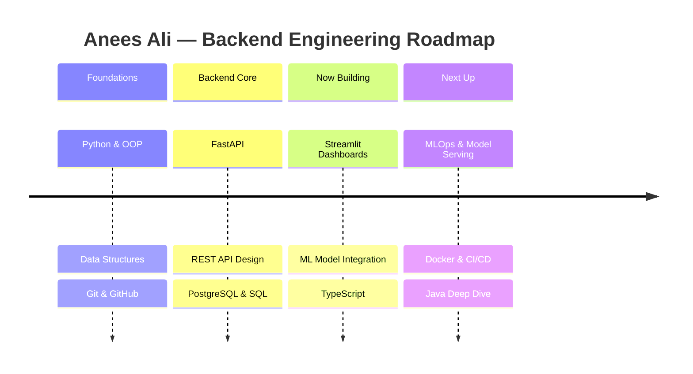

<div align="center">

<!-- ================= MATRIX BANNER ================= -->


</div>

<br/>

<!-- ================= TERMINAL BOOT SEQUENCE ================= -->
<div align="center">

```bash
$ ssh anees-ali@production-server
Authenticating... ✔ access granted

$ systemctl status anees-ali.service
● anees-ali.service - Software Engineer | Backend Systems
   Loaded: enabled (Python 3.11, FastAPI 0.115, PostgreSQL 16)
   Active: active (running) since 2022 — uptime: growing daily 📈
   Main PID: 1337 (learning.exe)
```


</div>

<br/>

<!-- ================= LIVE BADGES ================= -->
<div align="center">


</div>

<br/>

---

## 📡 `GET /about-me`

<table>
<tr>
<td width="55%" valign="top">

```json
{
  "developer": "Anees Ali",
  "role": "Software Engineering Student",
  "focus": "Backend Systems & ML Deployment",
  "location": "Pakistan 🇵🇰",
  "currently_building": [
    "⚙️  REST APIs — FastAPI + PostgreSQL",
    "📊  Data dashboards — Streamlit",
    "🤖  Deploying ML models to production"
  ],
  "currently_learning": [
    "🧠  MLOps & model-serving pipelines",
    "🟦  TypeScript for typed frontends",
    "☕  Java OOP & design patterns"
  ],
  "response_time": "instant ⚡",
  "status_code": 200
}
```

</td>
<td width="45%" align="center" valign="middle">


</td>
</tr>
</table>

<div align="center">
<sub>💡 <b>console.log("git commit -m 'fixed bug'")</b> → introduces 3 new bugs. Every. Single. Time.</sub>
</div>

<br/>

---

## 🧬 `GET /architecture` — How I'm wired



<br/>

---

## 🗺️ `GET /roadmap` — Current learning sprint



<br/>

---

## 🛠️ `GET /tech-stack`

<div align="center">

**⚙️ Backend & Languages**


**🤖 Data & Machine Learning**


**🗄️ Databases, Frontend & Tools**


</div>

<br/>

<!-- ================= SKILL RADAR ================= -->
<div align="center">

**📡 Skill Signal Strength**


<sub>Self-assessed — updated as the stack grows 🌱</sub>

</div>

<br/>

---

## 📊 `GET /metrics` — Live system dashboard

<div align="center">


</div>

<details>
<summary align="center">🏆 <b>Expand Trophy Case</b></summary>
<br/>
<div align="center">

</div>
</details>

<details>
<summary align="center">🌌 <b>Expand 3D Contribution Skyline</b></summary>
<br/>
<div align="center">

<sub>⚙️ Generated by the <code>profile3d.yml</code> Action — see setup notes below.</sub>
</div>
</details>

<br/>

<!-- ================= SNAKE ================= -->
<div align="center">

<sub>⚙️ Custom neon snake — generated by the <code>snake.yml</code> Action, see setup notes below.</sub>
</div>

<br/>

---

## 📶 `GET /status` — Repo activity heatmap

<div align="center">

<br/>
<sub>Add this to your most active repo — auto-tracks PRs, issues & commits over time.</sub>
</div>

<br/>

---

## 🔌 `GET /connect`

<div align="center">

<a href="https://www.linkedin.com/in/YOUR-LINKEDIN-HANDLE" target="_blank">
  
</a>
<a href="mailto:your.email@example.com">
  
</a>
<a href="https://www.credly.com/users/YOUR-MICROSOFT-ACHIEVEMENTS-HANDLE" target="_blank">
  
</a>
<a href="https://github.com/DevEens-ali" target="_blank">
  
</a>

<br/><br/>


</div>

<br/>

---

<div align="center">

```bash
$ echo "Thanks for stopping by the server 🖥️"
> Thanks for stopping by the server 🖥️

$ git remote add collab https://github.com/DevEens-ali
> ⭐ Star or fork a repo — let's ship something together.
```


</div>
